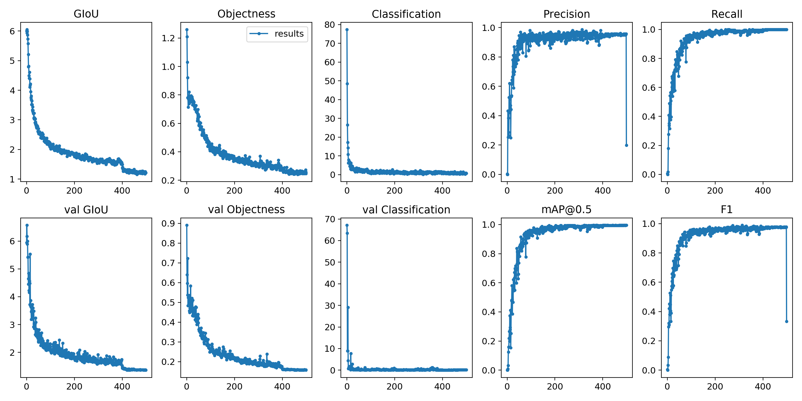
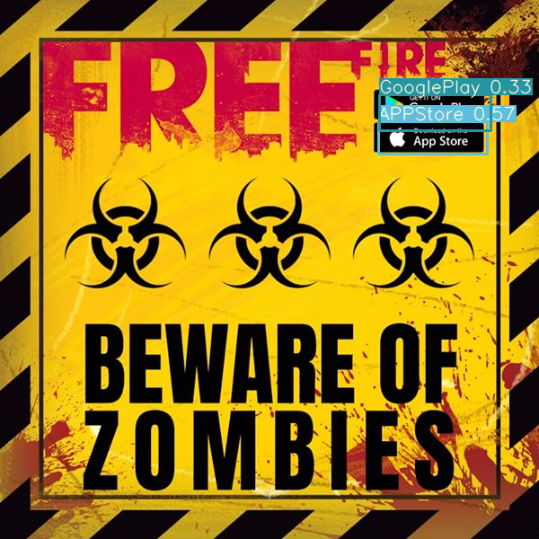

# Logo Detection yolov3
利用yolov3訓練的 Google Play 和 APP Store Logo辨識

## 資源與模型
訓練模型來源 : [yolov3](https://github.com/ultralytics/yolov3)  
訓練資料 : 自行蒐集與標記，共 270張訓練資料 30張測試資料 [標註器](https://github.com/developer0hye/Yolo_Label)  

### 訓練
```python train.py --data data/obj.data --cfg cfg/yolov3-tiny.cfg --weights weights/yolov3-tiny.weights --epochs 500 --batch-size 24```  
batch-size : 24  
模型 : yolov3-tiny (其他模型請至[這裡](https://drive.google.com/drive/folders/1LezFG5g3BCW6iYaV89B2i64cqEUZD7e0)下載，載完放到weights)  

### 預測
請將圖片放至 data/samples  
詳細請見 LogoDetection.ipynb  

## 成果
  
  
